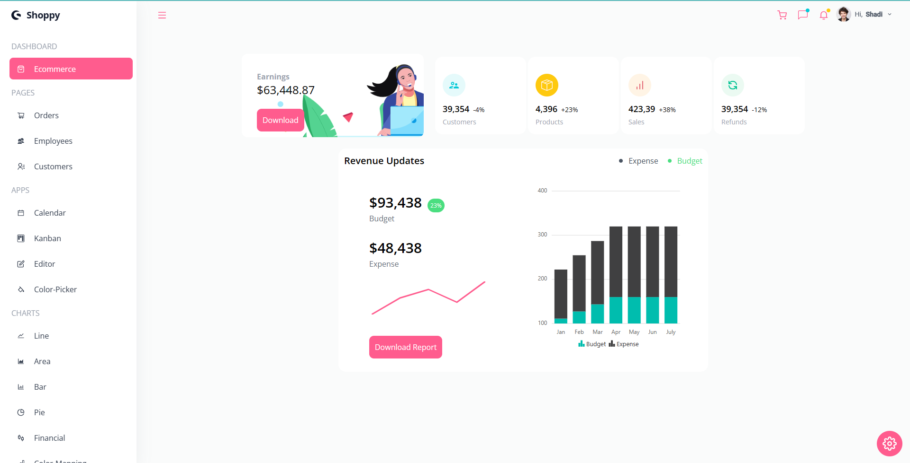
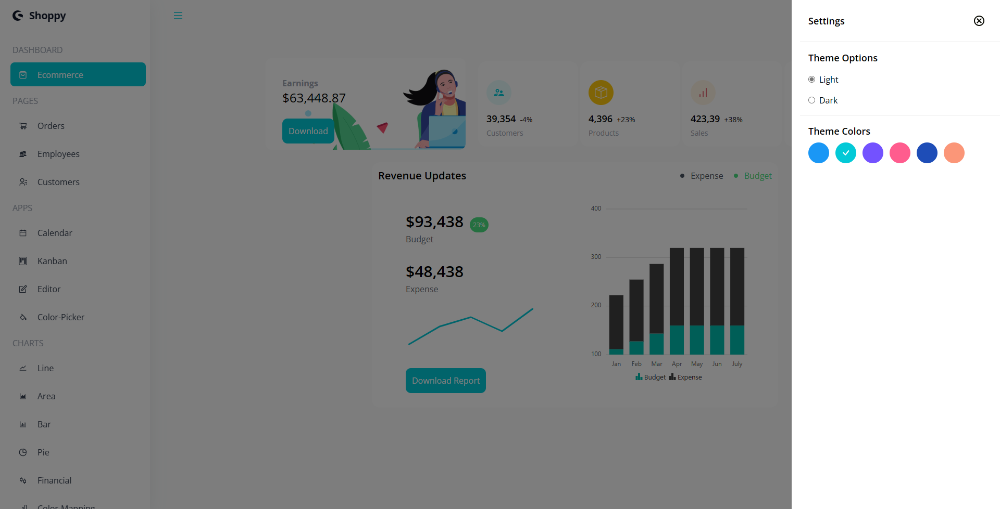
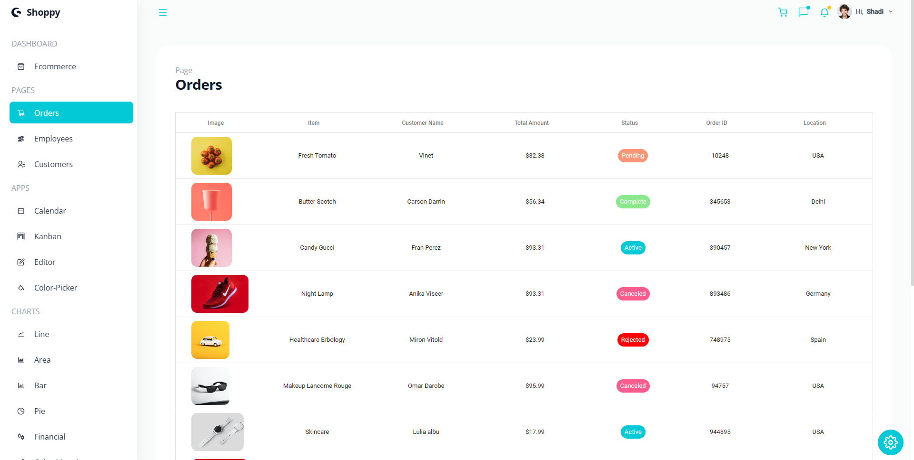
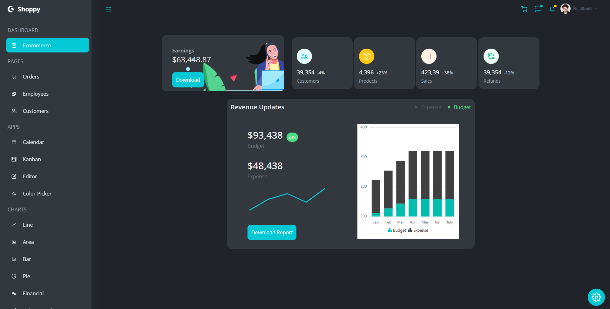
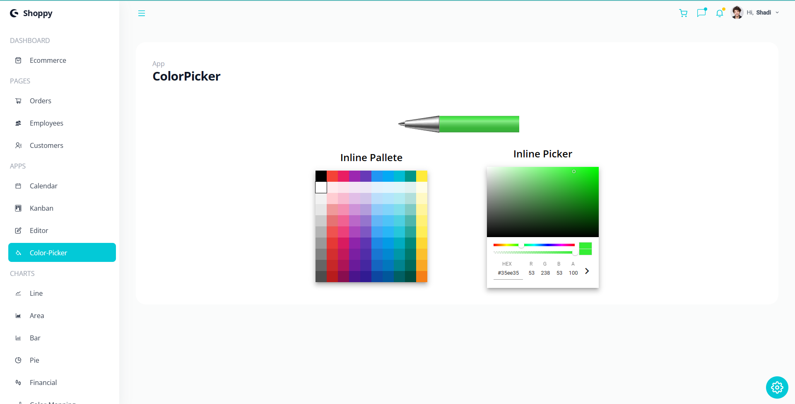
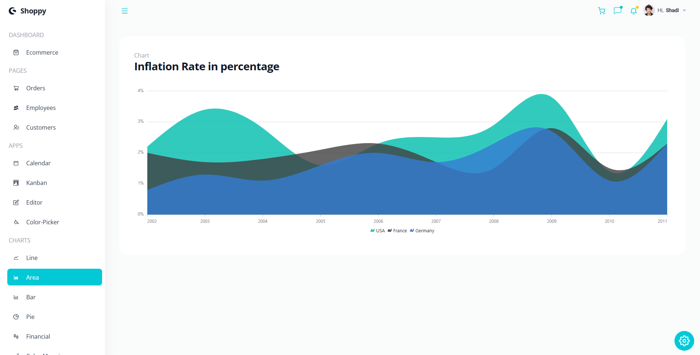
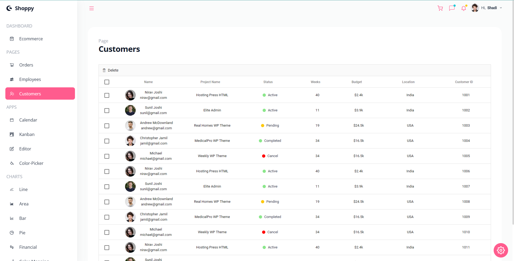
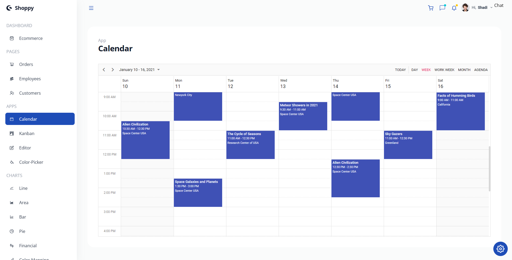

# Dashboard

Amazing React.js dashboard with beautiful UI built with help of Syncfusion and learn how to implement a complex components to my app.

## Learning Objectives

- Syncfusion
- Context API
- Responsive Design
- 
## Demo

https://dashboard-six-drab.vercel.app/

## App Preview

